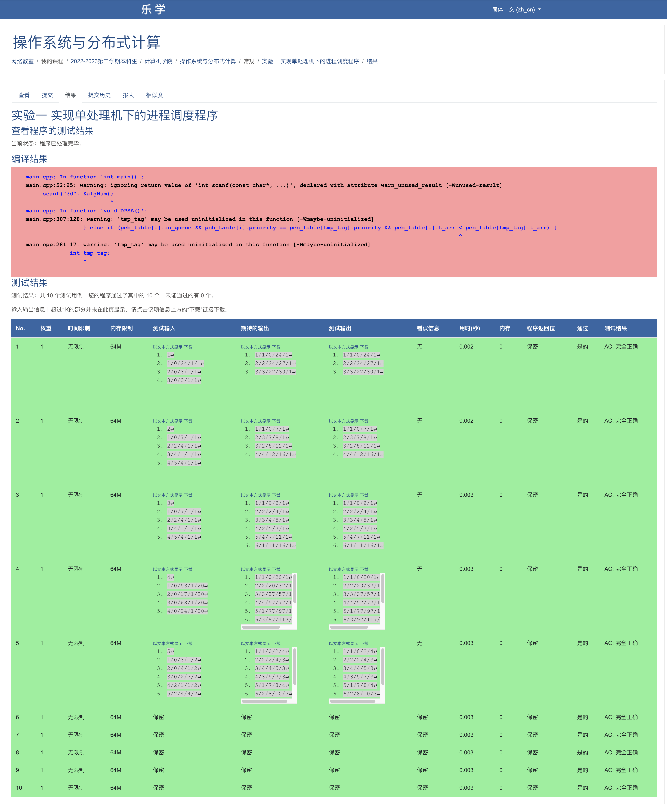

# 操作系统实验1——进程调度算法实验

### 1. 实验目的

进程是操作系统中最基本、最重要的概念，进程调度又是操作系统的核心模块。本实验要求编写一个单处理机下的进程调度程序，模拟操作系统对进程的调度。

要求如下：

1. 能够创建指定数量的进程，每个进程由一个进程控制块表示。
2. 实现先来先服务调度算法：进程到达时间可由进程创建时间表示。
3. 实现短作业优先调度算法：可指定进程要求的运行时间。（说明：对不可剥夺的短作业优先算法，当作业运行时间相等时，优先调度进程号小的进程执行；对可剥夺式的短作业优先算法，即选最短剩余时间的进程进行运行，在剩余时间相同的情况下，选择到达时间早的进程进行运行）
4.  实现时间片轮转调度算法：可指定生成时间片大小。（说明：新进程到来时插入到就绪队列的队尾，当进程P运行完一个时间片时，若同时有进程Q到达，则先在就绪队列队尾插入新到达的进程Q，之后再插入进程P)
5. 实现动态优先级调度算法：可指定进程的初始优先级（优先级与优先数成反比，优先级最高为0），优先级改变遵循下列原则：进程在就绪队列中每停留一个时间片，优先级加1，进程每运行一个时间片，优先级减3。（说明：本算法在优先级相同的情况下，选择到达时间早的进程进行运行）

### 2. 数据结构和符号说明

本实验中使用到的数据结构为`task_struct`，用来表示进程控制块，该数据结构定义如下：

```c
struct task_struct {
    int pid;                // 进程ID(Process ID): [0, 65535]
    int status;             // 进程状态

    int t_arr;              // 进程到达时间
    int t_run_init;         // 进程全部时间 t_run_init = t_run_exec + t_run_rest
    int t_run_exec;         // 进程执行时间 t_run_exec = t_stop - t_start
    int t_run_rest;         // 进程剩余时间 t_run_rest = t_run_init - t_run_exec
    int t_exec_start;       // 进程开始时间 t_exec_start = time_now()
    int t_exec_stop;        // 进程结束时间 t_exec_stop     = time_now()

    int order;              // 执行顺序
    int priority;           // 执行优先级
    int slot;               // 时间片
    bool finished;          // 是否完成标志
    bool in_queue;          // 是否在队列中标志
} pcb_table[1024];          // Process Control Block Table(Maybe from 0 to 65535)
```

此外，本次实验实现了五种进程调度算法，分别是FCFS、SFJ、SRTF、RR以及DPSA。在主函数中，针对不同输入，调用不同的进程调度策略。

### 3. 算法处理流程

#### 0. 主函数

在主函数中，首先从输入端获得算法序号，随后对输入的每个进程创建PCB，随后根据算法序号选择不同的进程调度算法并执行。

```c
int main() {
    // 0. Initialize
    int algNum = 0;
    // 1. Get the number of scheduling algorithms
    scanf("%d", &algNum);
    // 2. Read parameters from the command line
    while (~scanf("%d/%d/%d/%d/%d", &pcb_table[pcb_cnt].pid, &pcb_table[pcb_cnt].t_arr, &pcb_table[pcb_cnt].t_run_init, &pcb_table[pcb_cnt].priority, &pcb_table[pcb_cnt].slot)) {
        pcb_table[pcb_cnt].t_run_exec = 0;
        pcb_table[pcb_cnt].t_run_rest = pcb_table[pcb_cnt].t_run_init;
        pcb_table[pcb_cnt].t_exec_start = 0;
        pcb_table[pcb_cnt].t_exec_stop = 0;
        pcb_table[pcb_cnt].order = 0;
        pcb_table[pcb_cnt].finished = false;
        pcb_cnt++;
    }
    // 3. Call the algorithm
    switch (algNum) {
        case 1: FCFS(); break;
        case 2: SJF(); break;
        case 3: SRTF(); break;
        case 4: RR(); break;
        case 5: DPSA(); break;
    }
    return 0;
}
```

#### 1. FCFS

先来先服务调度算法，是简单、可靠、容易理解、实现⽅便的非抢占式进程调度算法，其具体实现如下：

```c
void FCFS() {
    // 0. Initialize
    int clock = 0;  // Clock to Record Time
    // 1. Sort the PCB Table
    sort(pcb_table, pcb_table + pcb_cnt, [](task_struct a, task_struct b) {
        if (a.t_arr != b.t_arr) return a.t_arr < b.t_arr;
        else return a.pid < b.pid;
    });
    // 2. Call the FCFS algorithm
    for (int i = 0; i < pcb_cnt; i++) {
        // (1) Set non-preemptive parameters
        pcb_table[i].t_run_exec = pcb_table[i].t_run_init;
        pcb_table[i].t_run_rest = pcb_table[i].t_run_init - pcb_table[i].t_run_exec;
        // (2) Get the start time and the stop time
        clock = max(clock, pcb_table[i].t_arr);
        pcb_table[i].t_exec_start = clock;
        pcb_table[i].t_exec_stop = pcb_table[i].t_exec_start + pcb_table[i].t_run_exec;
        clock = pcb_table[i].t_exec_stop;
        // (3) Set order and finish labels
        pcb_table[i].order = i + 1;
        pcb_table[i].finished = true;
        // (4) Output the results
        printf("%d/%d/%d/%d/%d\n", pcb_table[i].order, pcb_table[i].pid, pcb_table[i].t_exec_start, pcb_table[i].t_exec_stop, pcb_table[i].priority);
    }
}
```

在先来先服务算法中，首先设置整形变量`clock`模拟时间的进行，随后对PCB数组中的数据进行排序，比较的元素为进程到达时间和进程ID。从而实现了按照到达顺序排列的目的。随后执行FCFS算法。

在先来先服务算法中，首先设置执行开始时间并重置剩余时间。随后将时间设置为当前时间或者当前进程的到达时间，随后重置当前进程的时间参数，最后设置该进程的序号和完成标签，随后输出其结果。

#### 2. SJF

```c
// 0. Initialize
    int clock = 0;                      // Clock to Record Time
    int curr_tag = 0;                   // Current Process Subscript
    int finished_proc_cnt = 0;          // Total Number of Finished Processes
    for (int i = 0; i < pcb_cnt; i++) { // Set Non-preemptive Parameters
        pcb_table[i].t_run_exec = pcb_table[i].t_run_init;
        pcb_table[i].t_run_rest = pcb_table[i].t_run_init - pcb_table[i].t_run_exec;
    }
    // 1. Sort the PCB Table
    sort(pcb_table, pcb_table + pcb_cnt, [](task_struct a, task_struct b) {
        if (a.t_arr != b.t_arr) return a.t_arr < b.t_arr;
        else if (a.t_run_init != b.t_run_init) return a.t_run_init < b.t_run_init;
        else return a.pid < b.pid;
    });
    // 2. Call the SJF algorithm
    while (finished_proc_cnt != pcb_cnt) {
        // (1) Select a process that hasn't been finished(Except the first process)
        if (curr_tag != 0) {
            for (int i = 0; i < pcb_cnt; i++) {
                if (!pcb_table[i].finished) { curr_tag = i; break; }
            }
        }
        // (2) Select a process whose execution burst time is the shortest
        for (int i = 0; i < pcb_cnt; i++) {
            if (!pcb_table[i].finished && pcb_table[i].t_arr <= clock && \
                ((pcb_table[i].t_run_exec < pcb_table[curr_tag].t_run_exec) || (pcb_table[i].t_run_exec == pcb_table[curr_tag].t_run_exec && pcb_table[i].pid < pcb_table[curr_tag].pid))) {
                curr_tag = i;
            }
        }
        // (3) Execute the process
        finished_proc_cnt++;
        // (4) Get the start time
        clock = max(clock, pcb_table[curr_tag].t_arr);
        pcb_table[curr_tag].t_exec_start = clock;
        pcb_table[curr_tag].t_exec_stop = pcb_table[curr_tag].t_exec_start + pcb_table[curr_tag].t_run_exec;
        clock = pcb_table[curr_tag].t_exec_stop;
        // (5) Set order and finish labels
        pcb_table[curr_tag].order = finished_proc_cnt;
        pcb_table[curr_tag].finished = true;
        // (6) Output the results
        printf("%d/%d/%d/%d/%d\n", pcb_table[curr_tag].order, pcb_table[curr_tag].pid, pcb_table[curr_tag].t_exec_start, pcb_table[curr_tag].t_exec_stop, pcb_table[curr_tag].priority);
    }
}
```

在短进程优先算法中，首先设置时钟、当前进程标签、进程完成数的初始值。随后对根据输入的参数对进程的时间参数进行设置。完成初始化任务后，对整个PCB表进行排序，按照到达时间、进程运行时间、进程PID的优先级进行排序。

此时，可以开始执行SJF算法。首先选择一个还未完成的进程，随后选择一个执行时间最短的进程，此时执行当前进程并设置相关时间参数和完成标志，即可输出结果。

#### 3. SRTF

```c
void SRTF() {
    // 0. Initialize
    int clock = 0;                      // Clock to Record Time
    int order = 1;                      // Order
    int curr_tag = 0;                   // Current Process Subscript
    int prev_tag = 0;                   // Previous Process Subscript
    int t_fnshall = 0;                  // Time to finish all the processes
    for (int i = 0; i < pcb_cnt; i++) { // Get the t_fnshall and the arrival timestamps and initialize the rest running time
        t_fnshall += pcb_table[i].t_run_init;
        pcb_table[i].t_run_rest = pcb_table[i].t_run_init;
    }
    // 1. Sort the PCB Table
    sort(pcb_table, pcb_table + pcb_cnt, [](task_struct a, task_struct b) {
        if (a.t_arr != b.t_arr) return a.t_arr < b.t_arr;
        else if (a.t_run_init != b.t_run_init) return a.t_run_init < b.t_run_init;
        else return a.pid < b.pid;
    });
    // 2. Call the SRTF algorithm
    while (clock < t_fnshall) {
        // (1) Select the smallest job
        for (int i = 0; i < pcb_cnt; i++) {
            if (pcb_table[i].finished == false && pcb_table[i].t_arr <= clock && pcb_table[i].t_run_rest < pcb_table[curr_tag].t_run_rest) {
                curr_tag = i;
            }
        }
        // (3) Get the start time
        if (curr_tag != prev_tag) {
            pcb_table[curr_tag].t_exec_start = clock;
        }
        pcb_table[curr_tag].t_run_rest -= 1;
        clock += 1;
        // printf("curr_tag = %d, run_rest: %d\n", curr_tag, pcb_table[curr_tag].t_run_rest);
        if (curr_tag != prev_tag && pcb_table[prev_tag].finished == false) {
            pcb_table[prev_tag].t_exec_stop = clock - 1;
            pcb_table[prev_tag].order = order++;
            // output
            printf("%d/%d/%d/%d/%d\n", pcb_table[prev_tag].order, pcb_table[prev_tag].pid, pcb_table[prev_tag].t_exec_start, pcb_table[prev_tag].t_exec_stop, pcb_table[prev_tag].priority);
        }
        if (pcb_table[curr_tag].t_run_rest <= 0) {
            pcb_table[curr_tag].finished = true;
            pcb_table[curr_tag].t_exec_stop = clock;
            pcb_table[curr_tag].order = order++;
            printf("%d/%d/%d/%d/%d\n", pcb_table[curr_tag].order, pcb_table[curr_tag].pid, pcb_table[curr_tag].t_exec_start, pcb_table[curr_tag].t_exec_stop, pcb_table[curr_tag].priority);
        }
        prev_tag = curr_tag;
        if (pcb_table[curr_tag].finished) {
            for (int i = 0; i < pcb_cnt; i++) {
                if (pcb_table[i].finished == false) { curr_tag = i; break; }
            }
        }
    }
}
```

SRTF算法中，最终要的是中断的时间，因此，在进程被选中和执行的时候，必须要检查是否有新的进程到达和当前进程是否结束。为了方便实现该算法，该算法依旧设置了时钟，在循环中每次加一进行中断的检查，当有更短时间的进程时，则从未完成的进程池中选择时间最短的。此外还需要注意，有可能一个进程结束后，下一个进程还未到来的问题。

#### 4. RR

```c
void RR() {
    // 0. Initialize
    int clock = 0;
    int order = 1;
    int t_temp = 0;
    int t_comp_tmp = 0;
    int all_finished = 0;
    task_struct tmp_task;
    queue<task_struct> qready;
    // 1. Sort the PCB Table
    sort(pcb_table, pcb_table + pcb_cnt, [](task_struct a, task_struct b) {
        if (a.t_arr != b.t_arr) return a.t_arr < b.t_arr;
        else return a.pid < b.pid;
    });
    // 2. Get the t_fnshall and the arrival timestamps and initialize the rest running time
    for (int i = 0; i < pcb_cnt; i++) {
        pcb_table[i].in_queue = false;
        pcb_table[i].t_run_rest = pcb_table[i].t_run_init;
    }
    // 2. Call the RR algorithm
    qready.push(pcb_table[0]);
    pcb_table[0].in_queue = true;
    while (all_finished != pcb_cnt) {
        tmp_task = qready.front();
        qready.pop();
        t_temp = min(tmp_task.slot, tmp_task.t_run_rest);
        t_comp_tmp = tmp_task.t_run_rest;
        tmp_task.order = order++;
        clock = max(clock, tmp_task.t_arr);
        tmp_task.t_exec_start = clock;
        tmp_task.t_exec_stop = tmp_task.t_exec_start + t_temp;
        tmp_task.t_run_rest -= t_temp;
        printf("%d/%d/%d/%d/%d\n", tmp_task.order, tmp_task.pid, tmp_task.t_exec_start, tmp_task.t_exec_stop, tmp_task.priority);

        clock = tmp_task.t_exec_stop;

        for (int i = 0; i < pcb_cnt; i++) {
            if (pcb_table[i].t_arr <= clock && !pcb_table[i].in_queue) {
                qready.push(pcb_table[i]);
                pcb_table[i].in_queue = true;
            }
        }
        if (tmp_task.slot < t_comp_tmp) { 
            qready.push(tmp_task); 
        } else {
            all_finished++;
        }
    }
}
```

时间片轮转策略中，仅有当前进程完成时或者时间片用尽之时，才会产生中断，并在此时进行进程切换，因此对这两项进行判定即可，该算法相对较为简单且比较容易实现。

#### 5. DPSA

```c
void DPSA() {
    // 0. Set variables
    int clock = 0;                              // Clock to record current time
    int curr_tag = 0;                           // Subscription for current process
    int order = 1;                              // Sequence number for recording
    int all_finished = 0;                       // Flag to exit when all tasks have been finished
    // 1. Initialize variables
    for (int i = 0; i < pcb_cnt; i++) {         // Initialize original waitTimes
        pcb_table[i].finished = false;
        pcb_table[i].in_queue = false;
        pcb_table[i].t_run_exec = 0;
        pcb_table[i].t_run_rest = pcb_table[i].t_run_init;
    }
    // 2. Sort the PCB Table
    sort(pcb_table, pcb_table + pcb_cnt, [](task_struct a, task_struct b) {
        if (a.t_arr != b.t_arr) return a.t_arr < b.t_arr;
        else return a.pid < b.pid;
    });
    // 2. Call the DPSA algorithm
    while (all_finished < pcb_cnt) {
        // 2.1  Select the next process:
        //          if the ready queue is not empty, select the next process from the queue, 
        //          otherwise select from the rest not int the queue who comes first.
        // 2.1.1    Check if the queue is empty
        int in_queue = 0;
        for (int i = 0; i < pcb_cnt; i++) {
            if (pcb_table[i].in_queue) {
                in_queue++;
            }
        }
        // 2.1.2    Select the next process depending on the check result
        if (in_queue == 0) {
            int tmp_tag;
            for (int i = 0; i < pcb_cnt; i++) {
                if (!pcb_table[i].finished) {
                    tmp_tag = i;
                    break;
                }
            }
            for (int i = 0; i < pcb_cnt; i++) {
                if (!pcb_table[i].finished && pcb_table[i].t_arr < pcb_table[tmp_tag].t_arr) {
                    tmp_tag = i;
                } else if (!pcb_table[i].finished && pcb_table[i].t_arr == pcb_table[tmp_tag].t_arr && pcb_table[i].priority < pcb_table[tmp_tag].priority) {
                    tmp_tag = i;
                }
            }
            curr_tag = tmp_tag;
        } else {
            int tmp_tag;
            for (int i = 0; i < pcb_cnt; i++) {
                if (pcb_table[i].in_queue) {
                    tmp_tag = i;
                    break;
                }
            }
            for (int i = 0; i < pcb_cnt; i++) {
                if (pcb_table[i].in_queue && pcb_table[i].priority < pcb_table[tmp_tag].priority) {
                    tmp_tag = i;
                } else if (pcb_table[i].in_queue && pcb_table[i].priority == pcb_table[tmp_tag].priority && pcb_table[i].t_arr < pcb_table[tmp_tag].t_arr) {
                    tmp_tag = i;
                }
            }
            curr_tag = tmp_tag;
        }
        
        // 2.2  Run the Process
        // 2.2.1    Update the time to know the start time of current process
        clock = max(clock, pcb_table[curr_tag].t_arr);
        // 2.2.2    Execute the process
        pcb_table[curr_tag].t_exec_start = clock;
        pcb_table[curr_tag].t_run_exec = min(pcb_table[curr_tag].slot, pcb_table[curr_tag].t_run_rest);
        pcb_table[curr_tag].t_exec_stop = pcb_table[curr_tag].t_exec_start + pcb_table[curr_tag].t_run_exec;
        pcb_table[curr_tag].t_run_rest -= pcb_table[curr_tag].t_run_exec;
        pcb_table[curr_tag].order = order++;
        // 2.3  Execution is finished
        // 2.3.1    Update the clock again as it is at the stop time of current process
        clock = pcb_table[curr_tag].t_exec_stop;
        // 2.3.2    Update the priority of the current process
        pcb_table[curr_tag].priority += 3;
        // 2.3.3    Update the ready queue: if current process is finished, update its states
        if (pcb_table[curr_tag].t_run_rest > 0) {
            pcb_table[curr_tag].in_queue = true;
        } else {
            // Finished is true now
            pcb_table[curr_tag].finished = true;
            // Remove the process from ready queue
            pcb_table[curr_tag].in_queue = false;
            // Finished tag adds up
            all_finished++;
        }
        // 2.4  Output the result
        printf("%d/%d/%d/%d/%d\n", pcb_table[curr_tag].order, pcb_table[curr_tag].pid, pcb_table[curr_tag].t_exec_start, pcb_table[curr_tag].t_exec_stop, pcb_table[curr_tag].priority);

        // 2.5  Update the ready queue
        for (int i = 0;  i < pcb_cnt; i++) {
            if (!pcb_table[i].finished && !pcb_table[i].in_queue && pcb_table[i].t_arr <= clock) {
                pcb_table[i].in_queue = true;
            }
        }
        // 2.6  Update the priority of the rest processes
        for (int i = 0; i < pcb_cnt; i++) {
            if (i != curr_tag && pcb_table[i].in_queue && pcb_table[i].t_arr < clock) {
                if (pcb_table[i].priority > 0) {
                    pcb_table[i].priority -= 1;
                }
            }
        }
    }  
}
```

动态优先级算法中，首先要选择下一个进程，若就绪队列非空，则选择下一个进程入队，否则选择下一个到来的进程入队。随后执行进程，并更新进程的时间参数，当进程执行结束后，更新当前时间和进程优先级，若已经完成，则将进程移出就绪队列。随后分别更新就绪队列和剩余进程的优先级即可。

### 4. 源程序及注释

完整源代码及注释如下：

```c
/* Process Scheduling Algorithms */
#include <iostream>
#include <algorithm>
#include <cstdio>
#include <queue>

using namespace std;

/*
 * Process Control Block Table:
 * 1. Singleton: 
 *      This should be a singleton structure, which is also a global variable that may be accessed by other processes.
 * 2. Signal Handler: (TODO)
 *      Another thing to note is that maybe I should implement a signal handler to make scheduling easier.
 */
struct task_struct {
    int pid;                // Process ID: [0, 65535]
    int status;             // Status(Maybe enum value)

    int t_arr;              // Arrival Time
    int t_run_init;         // Initial Burst Time:          t_run_init      = t_run_exec + t_run_rest
    int t_run_exec;         // Executed Burst Time:         t_run_exec      = t_stop - t_start
    int t_run_rest;         // Rest Burst Time:             t_run_rest      = t_run_init - t_run_exec
    int t_exec_start;       // Execution Start Time:        t_exec_start    = time_now()
    int t_exec_stop;        // Execution Stop Time:         t_exec_stop     = time_now()

    int order;              // Execution Order
    int priority;           // Execution Priority
    int slot;               // Slot
    bool finished;          // Finished Tag
    bool in_queue;          // Flag
} pcb_table[1024];          // Process Control Block Table(Maybe from 0 to 65535)
int pcb_cnt = 0;            // PCB Counter

/*
 * Scheduling Algorithms:
 * 1. FCFS:
 * 2. SJF:
 * 3. SRTF:
 * 4. RR:
 * 5. DPSA:
 */
void FCFS();
void SJF();
void SRTF();
void RR();
void DPSA();

int main() {
    // 0. Initialize
    int algNum = 0;
    // 1. Get the number of scheduling algorithms
    scanf("%d", &algNum);
    // 2. Read parameters from the command line
    while (~scanf("%d/%d/%d/%d/%d", &pcb_table[pcb_cnt].pid, &pcb_table[pcb_cnt].t_arr, &pcb_table[pcb_cnt].t_run_init, &pcb_table[pcb_cnt].priority, &pcb_table[pcb_cnt].slot)) {
        pcb_table[pcb_cnt].t_run_exec = 0;
        pcb_table[pcb_cnt].t_run_rest = pcb_table[pcb_cnt].t_run_init;
        pcb_table[pcb_cnt].t_exec_start = 0;
        pcb_table[pcb_cnt].t_exec_stop = 0;
        pcb_table[pcb_cnt].order = 0;
        pcb_table[pcb_cnt].finished = false;
        pcb_cnt++;
    }
    // 3. Call the algorithm
    switch (algNum) {
        case 1: FCFS(); break;
        case 2: SJF(); break;
        case 3: SRTF(); break;
        case 4: RR(); break;
        case 5: DPSA(); break;
    }
    return 0;
}

void FCFS() {
    // 0. Initialize
    int clock = 0;  // Clock to Record Time
    // 1. Sort the PCB Table
    sort(pcb_table, pcb_table + pcb_cnt, [](task_struct a, task_struct b) {
        if (a.t_arr != b.t_arr) return a.t_arr < b.t_arr;
        else return a.pid < b.pid;
    });
    // 2. Call the FCFS algorithm
    for (int i = 0; i < pcb_cnt; i++) {
        // (1) Set non-preemptive parameters
        pcb_table[i].t_run_exec = pcb_table[i].t_run_init;
        pcb_table[i].t_run_rest = pcb_table[i].t_run_init - pcb_table[i].t_run_exec;
        // (2) Get the start time and the stop time
        clock = max(clock, pcb_table[i].t_arr);
        pcb_table[i].t_exec_start = clock;
        pcb_table[i].t_exec_stop = pcb_table[i].t_exec_start + pcb_table[i].t_run_exec;
        clock = pcb_table[i].t_exec_stop;
        // (3) Set order and finish labels
        pcb_table[i].order = i + 1;
        pcb_table[i].finished = true;
        // (4) Output the results
        printf("%d/%d/%d/%d/%d\n", pcb_table[i].order, pcb_table[i].pid, pcb_table[i].t_exec_start, pcb_table[i].t_exec_stop, pcb_table[i].priority);
    }
}

void SJF() {
    // 0. Initialize
    int clock = 0;                      // Clock to Record Time
    int curr_tag = 0;                   // Current Process Subscript
    int finished_proc_cnt = 0;          // Total Number of Finished Processes
    for (int i = 0; i < pcb_cnt; i++) { // Set Non-preemptive Parameters
        pcb_table[i].t_run_exec = pcb_table[i].t_run_init;
        pcb_table[i].t_run_rest = pcb_table[i].t_run_init - pcb_table[i].t_run_exec;
    }
    // 1. Sort the PCB Table
    sort(pcb_table, pcb_table + pcb_cnt, [](task_struct a, task_struct b) {
        if (a.t_arr != b.t_arr) return a.t_arr < b.t_arr;
        else if (a.t_run_init != b.t_run_init) return a.t_run_init < b.t_run_init;
        else return a.pid < b.pid;
    });
    // 2. Call the SJF algorithm
    while (finished_proc_cnt != pcb_cnt) {
        // (1) Select a process that hasn't been finished(Except the first process)
        if (curr_tag != 0) {
            for (int i = 0; i < pcb_cnt; i++) {
                if (!pcb_table[i].finished) { curr_tag = i; break; }
            }
        }
        // (2) Select a process whose execution burst time is the shortest
        for (int i = 0; i < pcb_cnt; i++) {
            if (!pcb_table[i].finished && pcb_table[i].t_arr <= clock && \
                ((pcb_table[i].t_run_exec < pcb_table[curr_tag].t_run_exec) || (pcb_table[i].t_run_exec == pcb_table[curr_tag].t_run_exec && pcb_table[i].pid < pcb_table[curr_tag].pid))) {
                curr_tag = i;
            }
        }
        // (3) Execute the process
        finished_proc_cnt++;
        // (4) Get the start time
        clock = max(clock, pcb_table[curr_tag].t_arr);
        pcb_table[curr_tag].t_exec_start = clock;
        pcb_table[curr_tag].t_exec_stop = pcb_table[curr_tag].t_exec_start + pcb_table[curr_tag].t_run_exec;
        clock = pcb_table[curr_tag].t_exec_stop;
        // (5) Set order and finish labels
        pcb_table[curr_tag].order = finished_proc_cnt;
        pcb_table[curr_tag].finished = true;
        // (6) Output the results
        printf("%d/%d/%d/%d/%d\n", pcb_table[curr_tag].order, pcb_table[curr_tag].pid, pcb_table[curr_tag].t_exec_start, pcb_table[curr_tag].t_exec_stop, pcb_table[curr_tag].priority);
    }
}

void SRTF() {
    // 0. Initialize
    int clock = 0;                      // Clock to Record Time
    int order = 1;                      // Order
    int curr_tag = 0;                   // Current Process Subscript
    int prev_tag = 0;                   // Previous Process Subscript
    int t_fnshall = 0;                  // Time to finish all the processes
    for (int i = 0; i < pcb_cnt; i++) { // Get the t_fnshall and the arrival timestamps and initialize the rest running time
        t_fnshall += pcb_table[i].t_run_init;
        pcb_table[i].t_run_rest = pcb_table[i].t_run_init;
    }
    // 1. Sort the PCB Table
    sort(pcb_table, pcb_table + pcb_cnt, [](task_struct a, task_struct b) {
        if (a.t_arr != b.t_arr) return a.t_arr < b.t_arr;
        else if (a.t_run_init != b.t_run_init) return a.t_run_init < b.t_run_init;
        else return a.pid < b.pid;
    });
    // 2. Call the SRTF algorithm
    while (clock < t_fnshall) {
        // (1) Select the smallest job
        for (int i = 0; i < pcb_cnt; i++) {
            if (pcb_table[i].finished == false && pcb_table[i].t_arr <= clock && pcb_table[i].t_run_rest < pcb_table[curr_tag].t_run_rest) {
                curr_tag = i;
            }
        }
        // (3) Get the start time
        if (curr_tag != prev_tag) {
            pcb_table[curr_tag].t_exec_start = clock;
        }
        pcb_table[curr_tag].t_run_rest -= 1;
        clock += 1;
        // printf("curr_tag = %d, run_rest: %d\n", curr_tag, pcb_table[curr_tag].t_run_rest);
        if (curr_tag != prev_tag && pcb_table[prev_tag].finished == false) {
            pcb_table[prev_tag].t_exec_stop = clock - 1;
            pcb_table[prev_tag].order = order++;
            // output
            printf("%d/%d/%d/%d/%d\n", pcb_table[prev_tag].order, pcb_table[prev_tag].pid, pcb_table[prev_tag].t_exec_start, pcb_table[prev_tag].t_exec_stop, pcb_table[prev_tag].priority);
        }
        if (pcb_table[curr_tag].t_run_rest <= 0) {
            pcb_table[curr_tag].finished = true;
            pcb_table[curr_tag].t_exec_stop = clock;
            pcb_table[curr_tag].order = order++;
            printf("%d/%d/%d/%d/%d\n", pcb_table[curr_tag].order, pcb_table[curr_tag].pid, pcb_table[curr_tag].t_exec_start, pcb_table[curr_tag].t_exec_stop, pcb_table[curr_tag].priority);
        }
        prev_tag = curr_tag;
        if (pcb_table[curr_tag].finished) {
            for (int i = 0; i < pcb_cnt; i++) {
                if (pcb_table[i].finished == false) { curr_tag = i; break; }
            }
        }
    }
}

void RR() {
    // 0. Initialize
    int clock = 0;
    int order = 1;
    int t_temp = 0;
    int t_comp_tmp = 0;
    int all_finished = 0;
    task_struct tmp_task;
    queue<task_struct> qready;
    // 1. Sort the PCB Table
    sort(pcb_table, pcb_table + pcb_cnt, [](task_struct a, task_struct b) {
        if (a.t_arr != b.t_arr) return a.t_arr < b.t_arr;
        else return a.pid < b.pid;
    });
    // 2. Get the t_fnshall and the arrival timestamps and initialize the rest running time
    for (int i = 0; i < pcb_cnt; i++) {
        pcb_table[i].in_queue = false;
        pcb_table[i].t_run_rest = pcb_table[i].t_run_init;
    }
    // 2. Call the RR algorithm
    qready.push(pcb_table[0]);
    pcb_table[0].in_queue = true;
    while (all_finished != pcb_cnt) {
        tmp_task = qready.front();
        qready.pop();

        t_temp = min(tmp_task.slot, tmp_task.t_run_rest);
        t_comp_tmp = tmp_task.t_run_rest;
        tmp_task.order = order++;
        clock = max(clock, tmp_task.t_arr);
        tmp_task.t_exec_start = clock;
        tmp_task.t_exec_stop = tmp_task.t_exec_start + t_temp;
        tmp_task.t_run_rest -= t_temp;
        printf("%d/%d/%d/%d/%d\n", tmp_task.order, tmp_task.pid, tmp_task.t_exec_start, tmp_task.t_exec_stop, tmp_task.priority);

        clock = tmp_task.t_exec_stop;

        for (int i = 0; i < pcb_cnt; i++) {
            if (pcb_table[i].t_arr <= clock && !pcb_table[i].in_queue) {
                qready.push(pcb_table[i]);
                pcb_table[i].in_queue = true;
            }
        }
        if (tmp_task.slot < t_comp_tmp) { 
            qready.push(tmp_task); 
        } else {
            all_finished++;
        }
    }
}

void DPSA() {
    // 0. Set variables
    int clock = 0;                              // Clock to record current time
    int curr_tag = 0;                           // Subscription for current process
    int order = 1;                              // Sequence number for recording
    int all_finished = 0;                       // Flag to exit when all tasks have been finished
    // 1. Initialize variables
    for (int i = 0; i < pcb_cnt; i++) {         // Initialize original waitTimes
        pcb_table[i].finished = false;
        pcb_table[i].in_queue = false;
        pcb_table[i].t_run_exec = 0;
        pcb_table[i].t_run_rest = pcb_table[i].t_run_init;
    }
    // 2. Sort the PCB Table
    sort(pcb_table, pcb_table + pcb_cnt, [](task_struct a, task_struct b) {
        if (a.t_arr != b.t_arr) return a.t_arr < b.t_arr;
        else return a.pid < b.pid;
    });
    // 2. Call the DPSA algorithm
    while (all_finished < pcb_cnt) {
        // 2.1  Select the next process:
        //          if the ready queue is not empty, select the next process from the queue, 
        //          otherwise select from the rest not int the queue who comes first.
        // 2.1.1    Check if the queue is empty
        int in_queue = 0;
        for (int i = 0; i < pcb_cnt; i++) {
            if (pcb_table[i].in_queue) {
                in_queue++;
            }
        }
        // 2.1.2    Select the next process depending on the check result
        if (in_queue == 0) {
            int tmp_tag;
            for (int i = 0; i < pcb_cnt; i++) {
                if (!pcb_table[i].finished) {
                    tmp_tag = i;
                    break;
                }
            }
            for (int i = 0; i < pcb_cnt; i++) {
                if (!pcb_table[i].finished && pcb_table[i].t_arr < pcb_table[tmp_tag].t_arr) {
                    tmp_tag = i;
                } else if (!pcb_table[i].finished && pcb_table[i].t_arr == pcb_table[tmp_tag].t_arr && pcb_table[i].priority < pcb_table[tmp_tag].priority) {
                    tmp_tag = i;
                }
            }
            curr_tag = tmp_tag;
        } else {
            int tmp_tag;
            for (int i = 0; i < pcb_cnt; i++) {
                if (pcb_table[i].in_queue) {
                    tmp_tag = i;
                    break;
                }
            }
            for (int i = 0; i < pcb_cnt; i++) {
                if (pcb_table[i].in_queue && pcb_table[i].priority < pcb_table[tmp_tag].priority) {
                    tmp_tag = i;
                } else if (pcb_table[i].in_queue && pcb_table[i].priority == pcb_table[tmp_tag].priority && pcb_table[i].t_arr < pcb_table[tmp_tag].t_arr) {
                    tmp_tag = i;
                }
            }
            curr_tag = tmp_tag;
        }
        
        // 2.2  Run the Process
        // 2.2.1    Update the time to know the start time of current process
        clock = max(clock, pcb_table[curr_tag].t_arr);
        // 2.2.2    Execute the process
        pcb_table[curr_tag].t_exec_start = clock;
        pcb_table[curr_tag].t_run_exec = min(pcb_table[curr_tag].slot, pcb_table[curr_tag].t_run_rest);
        pcb_table[curr_tag].t_exec_stop = pcb_table[curr_tag].t_exec_start + pcb_table[curr_tag].t_run_exec;
        pcb_table[curr_tag].t_run_rest -= pcb_table[curr_tag].t_run_exec;
        pcb_table[curr_tag].order = order++;
        // 2.3  Execution is finished
        // 2.3.1    Update the clock again as it is at the stop time of current process
        clock = pcb_table[curr_tag].t_exec_stop;
        // 2.3.2    Update the priority of the current process
        pcb_table[curr_tag].priority += 3;
        // 2.3.3    Update the ready queue: if current process is finished, update its states
        if (pcb_table[curr_tag].t_run_rest > 0) {
            pcb_table[curr_tag].in_queue = true;
        } else {
            // Finished is true now
            pcb_table[curr_tag].finished = true;
            // Remove the process from ready queue
            pcb_table[curr_tag].in_queue = false;
            // Finished tag adds up
            all_finished++;
        }
        // 2.4  Output the result
        printf("%d/%d/%d/%d/%d\n", pcb_table[curr_tag].order, pcb_table[curr_tag].pid, pcb_table[curr_tag].t_exec_start, pcb_table[curr_tag].t_exec_stop, pcb_table[curr_tag].priority);

        // 2.5  Update the ready queue
        for (int i = 0;  i < pcb_cnt; i++) {
            if (!pcb_table[i].finished && !pcb_table[i].in_queue && pcb_table[i].t_arr <= clock) {
                pcb_table[i].in_queue = true;
            }
        }
        // 2.6  Update the priority of the rest processes
        for (int i = 0; i < pcb_cnt; i++) {
            if (i != curr_tag && pcb_table[i].in_queue && pcb_table[i].t_arr < clock) {
                if (pcb_table[i].priority > 0) {
                    pcb_table[i].priority -= 1;
                }
            }
        }
    }  
}
```

### 5. 测试方法与结果

本次实验的测试使用黑盒测试的方法，借助乐学在线OJ系统，最终结果为测试全部通过。



### 6. 实验经验和体会

通过本次实验，我认为在进行进程调度实验之前，要充分理解各种调度算法的原理、特点和适用场景。这有助于更好地设计实验和分析结果；在设计实验时，需要考虑不同场景和参数设置，以覆盖各种情况。确保实验设计的合理性和全面性，以获得更准确的实验结果；在编写模拟程序时，要确保算法的实现正确无误，并进行充分的测试。此外，本次实验为进程调度算法实验，实际上不仅仅是考验我们对算法执行流程的理解，更关键的是，不论是哪一种算法，什么时候中断、怎么中断、中断后怎么转换进程才是核心之重，掌握了这些，编写该实验就会轻松很多，编出的程序也更有逻辑并且更为高效。此外，本次实验我还在已经完成的实验的基础上进行了不少完善，一定程度上优化了原有的算法，是整个程序结构和条理更加清晰，从而提高了程序质量和安全性。
