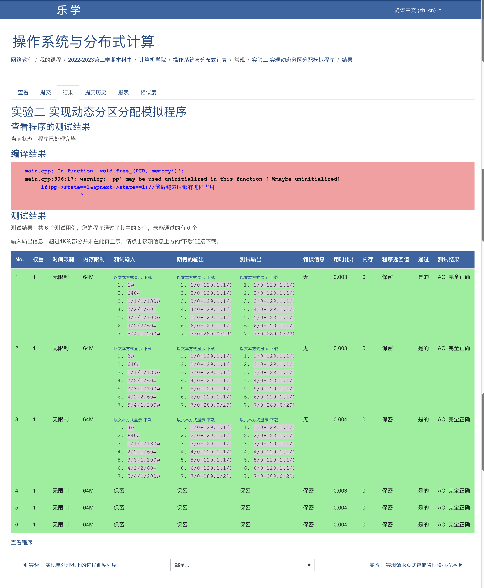

# 操作系统实验2——动态内存分配算法实验

### 1. 实验目的

通过本次实验，需要我们理解动态内存分配的概念和原理，学习不同的动态内存分配算法，如首次适应、最佳适应和最坏适应算法，并比较它们的性能和适用场景。其次，我们还需要掌握实现和设计动态内存分配算法的基本步骤和技巧。第三，通过本次实验，我们可以通过数据直观的分析和评估不同动态内存分配算法在不同情况下的效果和性能。最后，通过本次实验，我们可以获得实践动态内存分配的经验和体会，加深对内存管理的理解。

### 2. 数据结构和符号说明

本次实验中，采用以下数据结构：

- MState内存块状态：其值为已使用和未使用，用来代表当前内存块是否被占用。
- Memory结构体：包含内存块的起始地址、大小、占用的进程PID、内存块状态以及下一个内存块的地址。
- ReqList请求列表结构体：用来存储输入内容，包括请求的序号、进程PID、操作代码、内存大小。
- pFunc函数指针：由于要采用不同的算法，但是每种算法的输入基本相同，故使用函数指针，以增强整体程序的拓展性并降低耦合。
- 函数有FF分配函数、BF分配函数、WF分配函数、内存释放程序、输出函数。

```c
#include <cstdio>
#include <cstdlib>
#define MAX_MEM_SIZE 65535

using namespace std;

// MState 内存块的状态
enum MState {UNUSED, USED};
// Memory 内存块结构体
struct Memory {
    int startAddr;          // 起始地址
    int endAddr;            // 结束地址
    int size;               // 内存块大小
    int pid;                // 进程ID
    MState state;           // 内存块状态
    struct Memory *next;    // 下一个内存块
};
// ReqList 请求列表
struct Request {
    int sn;         // serial number
    int pid;        // process id
    int op;         // operation
    int opVol;      // volume of operation
} rList[1024];
// pFunc 函数指针：用于不同的内存分配算法
typedef void (*pFunc)(Request request, Memory *mem);
// FF 分配函数
void FFalloc(Request request, Memory *mem);
// BF 分配函数
void BFalloc(Request request, Memory *mem);
// WF 分配函数
void WFalloc(Request request, Memory *mem);
// 内存释放函数
void memFree(Request request, Memory *mem);
// 结果输出函数
void output(Request request, Memory *mem);
```

### 3. 算法处理流程

#### 0. 主函数

首先获取算法和内存大小，随后从输入端获取输入数据，存到请求列表中。随后初始化内存，随后根据输入的函数代号，选择相应的内存分配函数，最后执行算法。

```c
int main()
{
    int algNum = 0;             // number of algorithms
    int memSize = 0;            // size of memory
    int num = 0;                // number of current request
    pFunc pAlloc;               // function to allocate
    Memory *memory;             // memory
    // 1. 读取算法和内存大小
    scanf("%d %d", &algNum, &memSize);
    // 2. 读取请求序列
		while (~scanf("%d/%d/%d/%d", &rList[num].sn, &rList[num].pid, &rList[num].op, &rList[num].opVol)) { num++; }
    // 3. 初始化内存
    memory = (Memory*)malloc(sizeof(Memory));
    memory->startAddr = 0;
    memory->endAddr = memSize - 1;
    memory->size = memSize;
    memory->pid = -1;
    memory->state = UNUSED;
    memory->next = nullptr;
    // 4. 算法选择
    switch (algNum) {
        case 1: pAlloc = FFalloc; break;
        case 2: pAlloc = BFalloc; break;
        case 3: pAlloc = WFalloc; break;
        default: {
            printf("Unknown algorithm");
            exit(EXIT_FAILURE);
        }
    }
    // 5. 执行算法
    for (int i = 0; i < num; i++) {
        if (rList[i].op == 1) {
            pAlloc(rList[i], memory);
        } else if (rList[i].op == 2) {
            memFree(rList[i], memory);
        } else {
            printf("Error: Invalid operation number %d", i);
            exit(EXIT_FAILURE);
        }
        output(rList[i], memory);
    }
    return 0;
}
```

#### 1. FF分配函数

在FF分配函数中，只需要根据请求的内存大小，从头开始选择合适的内存块即可。首先将进程装入内存，随后在剩余内存空间重新接入空闲链表。

```c
void FFalloc(Request request, Memory *mem)
{
    while (mem != nullptr) {
        if (request.opVol < mem->size && mem->state == UNUSED) {
            // 1. 将进程装入内存
            int oriEndAddr = mem->endAddr;
            mem->endAddr = mem->startAddr + request.opVol - 1;
            mem->size = request.opVol;
            mem->pid = request.pid;
            mem->state = USED;
            // 2. 剩余空闲内存重新接入链表
            auto *restMem = (Memory*)malloc(sizeof(Memory));
            restMem->startAddr = mem->endAddr + 1;
            restMem->endAddr = oriEndAddr;
            restMem->size = restMem->endAddr - restMem->startAddr + 1;
            restMem->pid = -1;
            restMem->state = UNUSED;
            restMem->next = mem->next;
            mem->next = restMem;
            break;
        } else if (request.opVol == mem->size && mem->state == UNUSED) {
            mem->pid = request.pid;
            mem->state = USED;
            break;
        }
        mem = mem->next;
    }
}
```

#### 2. BF分配函数

BF函数中，首先遍历一遍内存块链，选出和当前请求的内存的大小的差值的绝对值最小的内存块，随后将进程装入内存即可。

```c
void BFalloc(Request request, Memory *mem)
{
    int tmpRestMSize;
    int minRestMSize = MAX_MEM_SIZE;
    Memory *tmpMem = nullptr;
    while (mem != nullptr) {
        // 寻找剩余空间最小的空闲空间
        if (request.opVol <= mem->size && mem->state == UNUSED) {
            tmpRestMSize = mem->size - request.opVol;
            if (tmpRestMSize < minRestMSize) {
                minRestMSize = tmpRestMSize;
                tmpMem = mem;
            }
        }
        mem = mem->next;
    }
    if (tmpMem != nullptr) {
        // 与 FF 类似
        int oriEndAddr = tmpMem->endAddr;
        tmpMem->endAddr = tmpMem->startAddr + request.opVol - 1;
        tmpMem->size = request.opVol;
        tmpMem->pid = request.pid;
        tmpMem->state = USED;
        if (minRestMSize > 0) {
            auto *restMem = (Memory*)malloc(sizeof(Memory));
            restMem->startAddr = tmpMem->endAddr + 1;
            restMem->endAddr = oriEndAddr;
            restMem->size = minRestMSize;
            restMem->pid = -1;
            restMem->state = UNUSED;
            restMem->next = tmpMem->next;
            tmpMem->next = restMem;
        } else if (minRestMSize == 0) {
            // Do nothing!
        }
    }
}
```

#### 3. WF分配函数

WF函数与BF函数相反，需要选择差值最大的空闲内存块，随后将进程装入内存即可。

```c
void WFalloc(Request request, Memory *mem)
{
    int maxRestMSize = -1;
    Memory *tmpMem = nullptr;
    while (mem != nullptr) {
        // 寻找最大空闲空间
        if (request.opVol <= mem->size && mem->state == UNUSED && maxRestMSize < mem->size) {
            maxRestMSize = mem->size;
            tmpMem = mem;
        }
        mem = mem->next;
    }
    if (tmpMem != nullptr) {
        // 与 FF 类似
        int oriEndAddr = tmpMem->endAddr;
        tmpMem->endAddr = tmpMem->startAddr + request.opVol - 1;
        tmpMem->size = request.opVol;
        tmpMem->pid = request.pid;
        tmpMem->state = USED;
        if (maxRestMSize > 0) {
            auto *restMem = (Memory*)malloc(sizeof(Memory));
            restMem->startAddr = tmpMem->endAddr + 1;
            restMem->endAddr = oriEndAddr;
            restMem->size = restMem->endAddr - restMem->startAddr + 1;
            restMem->pid = -1;
            restMem->state = UNUSED;
            restMem->next = tmpMem->next;
            tmpMem->next = restMem;
        } else if (maxRestMSize == 0) {
            // Do nothing!
        }
    }
}
```

#### 4. 内存释放函数

内存释放主要有四种情况：

1. 当前内存块前后均有空闲空间——>释放并合并其前后空闲空间
2. 当前内存块前有空闲空间——>释放并合并其前面空闲空间
3. 当前内存块后有空闲空间——>释放并合并其后面空闲空间
4. 当前内存块前后均无空闲空间——>仅释放当前内存块

其中，当前块还有三种特殊情况:

 * 当前块是唯一内存块——>相当于情况4
 * 当前块是第一个内存块——>相当于情况3和情况4
 * 当前块是最后一个内存块——>相当于情况2和情况4

```c
// 内存释放函数
void memFree(Request request, Memory *mem)
{
    Memory *prevMem, *currMem, *nextMem;
    prevMem = mem;
    currMem = mem;
    nextMem = nullptr;
    // 1. 寻找当前请求的进程所在的内存块
    while (currMem != nullptr) {
        // 更新 Next Memory
        nextMem = currMem->next;
        // 判断当前内存块内的进程是否为发出请求的进程
        if (currMem->pid == request.pid) {
            // 更改内存状态并退出循环
            currMem->state = UNUSED;
            break;
        }
        // 更新 Previous Memory 和 Current Memory
        prevMem = currMem;
        currMem = nextMem;
    }
    // 2. 合并空闲内存空间并释放内存
    if (prevMem != currMem && nextMem != nullptr && prevMem->state == UNUSED && nextMem->state == UNUSED) {
        // 合并前后空闲空间
        prevMem->endAddr = nextMem->endAddr;
        prevMem->size = prevMem->size + currMem->size + nextMem->size;
        prevMem->pid = -1;
        prevMem->next = nextMem->next;
        free(currMem);
        free(nextMem);
    } else if (prevMem != currMem && prevMem->state == UNUSED && (nextMem == nullptr || nextMem->state == USED)) {
        // 合并前空闲空间
        prevMem->endAddr = currMem->endAddr;
        prevMem->size = prevMem->size + currMem->size;
        prevMem->pid = -1;
        prevMem->next = currMem->next;
        free(currMem);
    } else if (nextMem != nullptr && nextMem->state == UNUSED && (prevMem->state == USED || prevMem == currMem)) {
        // 合并后空闲空间
        currMem->endAddr = nextMem->endAddr;
        currMem->size = currMem->size + nextMem->size;
        currMem->pid = -1;
        currMem->next = nextMem->next;
        free(nextMem);
    } else {
        // Do Nothing
    }
}
```

#### 5. 输出函数

```c
void output(Request request, Memory *mem)
{
    printf("%d", request.sn);
    while (mem != nullptr) {
        if (mem->state == USED) {
            printf("/%d-%d.1.%d", mem->startAddr, mem->endAddr, mem->pid);
        } else if (mem->state == UNUSED) {
            printf("/%d-%d.0", mem->startAddr, mem->endAddr);
        }
        mem = mem->next;
    }
    printf("\n");
}
```


### 4. 源程序及注释

完整源代码及注释如下：

```c
/* Memory Dynamic Partition */
#include <cstdio>
#include <cstdlib>
#define MAX_MEM_SIZE 65535

using namespace std;

// MState 内存块的状态
enum MState {UNUSED, USED};
// Memory 内存块结构体
struct Memory {
    int startAddr;          // 起始地址
    int endAddr;            // 结束地址
    int size;               // 内存块大小
    int pid;                // 进程ID
    MState state;           // 内存块状态
    struct Memory *next;    // 下一个内存块
};
// ReqList 请求列表
struct Request {
    int sn;         // serial number
    int pid;        // process id
    int op;         // operation
    int opVol;      // volume of operation
} rList[1024];
// pFunc 函数指针：用于不同的内存分配算法
typedef void (*pFunc)(Request request, Memory *mem);
// FF 分配函数
void FFalloc(Request request, Memory *mem);
// BF 分配函数
void BFalloc(Request request, Memory *mem);
// WF 分配函数
void WFalloc(Request request, Memory *mem);
// 内存释放函数
void memFree(Request request, Memory *mem);
// 结果输出函数
void output(Request request, Memory *mem);

int main()
{
    int algNum = 0;             // number of algorithms
    int memSize = 0;            // size of memory
    int num = 0;                // number of current request
    pFunc pAlloc;               // function to allocate
    Memory *memory;             // memory
    // 1. 读取算法和内存大小
    scanf("%d %d", &algNum, &memSize);
    // 2. 读取请求序列
//    while (~scanf("%d/%d/%d/%d", &rList[num].sn, &rList[num].pid, &rList[num].op, &rList[num].opVol)) { num++; }
    // Test Start: Input
    int tmp = 17;
    for (int i = 0; i < tmp; i++) {
        scanf("%d/%d/%d/%d", &rList[i].sn, &rList[i].pid, &rList[i].op, &rList[i].opVol);
    }
    num = tmp;
    // Test End
    // 3. 初始化内存
    memory = (Memory*)malloc(sizeof(Memory));
    memory->startAddr = 0;
    memory->endAddr = memSize - 1;
    memory->size = memSize;
    memory->pid = -1;
    memory->state = UNUSED;
    memory->next = nullptr;
    // 4. 算法选择
    switch (algNum) {
        case 1: pAlloc = FFalloc; break;
        case 2: pAlloc = BFalloc; break;
        case 3: pAlloc = WFalloc; break;
        default: {
            printf("Unknown algorithm");
            exit(EXIT_FAILURE);
        }
    }
    // 5. 执行算法
    for (int i = 0; i < num; i++) {
        if (rList[i].op == 1) {
            pAlloc(rList[i], memory);
        } else if (rList[i].op == 2) {
            memFree(rList[i], memory);
        } else {
            printf("Error: Invalid operation number %d", i);
            exit(EXIT_FAILURE);
        }
        output(rList[i], memory);
    }
    return 0;
}
// FF 分配函数
void FFalloc(Request request, Memory *mem)
{
    while (mem != nullptr) {
        if (request.opVol < mem->size && mem->state == UNUSED) {
            // 1. 将进程装入内存
            int oriEndAddr = mem->endAddr;
            mem->endAddr = mem->startAddr + request.opVol - 1;
            mem->size = request.opVol;
            mem->pid = request.pid;
            mem->state = USED;
            // 2. 剩余空闲内存重新接入链表
            auto *restMem = (Memory*)malloc(sizeof(Memory));
            restMem->startAddr = mem->endAddr + 1;
            restMem->endAddr = oriEndAddr;
            restMem->size = restMem->endAddr - restMem->startAddr + 1;
            restMem->pid = -1;
            restMem->state = UNUSED;
            restMem->next = mem->next;
            mem->next = restMem;
            break;
        } else if (request.opVol == mem->size && mem->state == UNUSED) {
            mem->pid = request.pid;
            mem->state = USED;
            break;
        }
        mem = mem->next;
    }
}
// BF 分配函数
void BFalloc(Request request, Memory *mem)
{
    int tmpRestMSize;
    int minRestMSize = MAX_MEM_SIZE;
    Memory *tmpMem = nullptr;
    while (mem != nullptr) {
        // 寻找剩余空间最小的空闲空间
        if (request.opVol <= mem->size && mem->state == UNUSED) {
            tmpRestMSize = mem->size - request.opVol;
            if (tmpRestMSize < minRestMSize) {
                minRestMSize = tmpRestMSize;
                tmpMem = mem;
            }
        }
        mem = mem->next;
    }
    if (tmpMem != nullptr) {
        // 与 FF 类似
        int oriEndAddr = tmpMem->endAddr;
        tmpMem->endAddr = tmpMem->startAddr + request.opVol - 1;
        tmpMem->size = request.opVol;
        tmpMem->pid = request.pid;
        tmpMem->state = USED;
        if (minRestMSize > 0) {
            auto *restMem = (Memory*)malloc(sizeof(Memory));
            restMem->startAddr = tmpMem->endAddr + 1;
            restMem->endAddr = oriEndAddr;
            restMem->size = minRestMSize;
            restMem->pid = -1;
            restMem->state = UNUSED;
            restMem->next = tmpMem->next;
            tmpMem->next = restMem;
        } else if (minRestMSize == 0) {
            // Do nothing!
        }
    }
}
// WF 分配函数
void WFalloc(Request request, Memory *mem)
{
    int maxRestMSize = -1;
    Memory *tmpMem = nullptr;
    while (mem != nullptr) {
        // 寻找最大空闲空间
        if (request.opVol <= mem->size && mem->state == UNUSED && maxRestMSize < mem->size) {
            maxRestMSize = mem->size;
            tmpMem = mem;
        }
        mem = mem->next;
    }
    if (tmpMem != nullptr) {
        // 与 FF 类似
        int oriEndAddr = tmpMem->endAddr;
        tmpMem->endAddr = tmpMem->startAddr + request.opVol - 1;
        tmpMem->size = request.opVol;
        tmpMem->pid = request.pid;
        tmpMem->state = USED;
        if (maxRestMSize > 0) {
            auto *restMem = (Memory*)malloc(sizeof(Memory));
            restMem->startAddr = tmpMem->endAddr + 1;
            restMem->endAddr = oriEndAddr;
            restMem->size = restMem->endAddr - restMem->startAddr + 1;
            restMem->pid = -1;
            restMem->state = UNUSED;
            restMem->next = tmpMem->next;
            tmpMem->next = restMem;
        } else if (maxRestMSize == 0) {
            // Do nothing!
        }
    }
}
// 内存释放函数
void memFree(Request request, Memory *mem)
{
    /*
     * 四种情况:
     * 1. 当前内存块前后均有空闲空间——>释放并合并其前后空闲空间
     * 2. 当前内存块前有空闲空间——>释放并合并其前面空闲空间
     * 3. 当前内存块后有空闲空间——>释放并合并其后面空闲空间
     * 4. 当前内存块前后均无空闲空间——>仅释放当前内存块
     * 其中，当前块还有三种特殊情况:
     * 1. 当前块是唯一内存块——>相当于情况4
     * 2. 当前块是第一个内存块——>相当于情况3和情况4
     * 3. 当前块是最后一个内存块——>相当于情况2和情况4
     */
    Memory *prevMem, *currMem, *nextMem;
    prevMem = mem;
    currMem = mem;
    nextMem = nullptr;
    // 1. 寻找当前请求的进程所在的内存块
    while (currMem != nullptr) {
        // 更新 Next Memory
        nextMem = currMem->next;
        // 判断当前内存块内的进程是否为发出请求的进程
        if (currMem->pid == request.pid) {
            // 更改内存状态并退出循环
            currMem->state = UNUSED;
            break;
        }
        // 更新 Previous Memory 和 Current Memory
        prevMem = currMem;
        currMem = nextMem;
    }
    // 2. 合并空闲内存空间并释放内存
    if (prevMem != currMem && nextMem != nullptr && prevMem->state == UNUSED && nextMem->state == UNUSED) {
        // 合并前后空闲空间
        prevMem->endAddr = nextMem->endAddr;
        prevMem->size = prevMem->size + currMem->size + nextMem->size;
        prevMem->pid = -1;
        prevMem->next = nextMem->next;
        free(currMem);
        free(nextMem);
    } else if (prevMem != currMem && prevMem->state == UNUSED && (nextMem == nullptr || nextMem->state == USED)) {
        // 合并前空闲空间
        prevMem->endAddr = currMem->endAddr;
        prevMem->size = prevMem->size + currMem->size;
        prevMem->pid = -1;
        prevMem->next = currMem->next;
        free(currMem);
    } else if (nextMem != nullptr && nextMem->state == UNUSED && (prevMem->state == USED || prevMem == currMem)) {
        // 合并后空闲空间
        currMem->endAddr = nextMem->endAddr;
        currMem->size = currMem->size + nextMem->size;
        currMem->pid = -1;
        currMem->next = nextMem->next;
        free(nextMem);
    } else {
        // Do Nothing
    }
}
// 结果输出函数
void output(Request request, Memory *mem)
{
    printf("%d", request.sn);
    while (mem != nullptr) {
        if (mem->state == USED) {
            printf("/%d-%d.1.%d", mem->startAddr, mem->endAddr, mem->pid);
        } else if (mem->state == UNUSED) {
            printf("/%d-%d.0", mem->startAddr, mem->endAddr);
        }
        mem = mem->next;
    }
    printf("\n");
}
```

### 5. 测试方法与结果

本次实验的测试使用黑盒测试的方法，借助乐学在线OJ系统，最终结果为测试全部通过。



### 6. 实验经验和体会

首先在进行动态内存分配模拟实验之前，需要仔细选择合适的内存分配算法。不同算法有不同的特点和性能表现，因此要根据输入选择最适合的算法。其次为了充分评估不同算法的性能，实验设计应涵盖各种场景和参数设置。例如，可以考虑不同的内存需求、内存释放顺序和内存碎片情况等因素，以获得全面的实验结果。通过实验，我们可以思考动态内存分配的应用领域和相关技术，如操作系统、嵌入式系统等。思考实验结果的实际意义和可行性，以及改进动态内存分配算法的可能性和方向。总的来说，通过实验我们可以加深对动态内存分配原理和算法的理解，掌握实践技巧，并思考其在实际系统中的应用和改进。