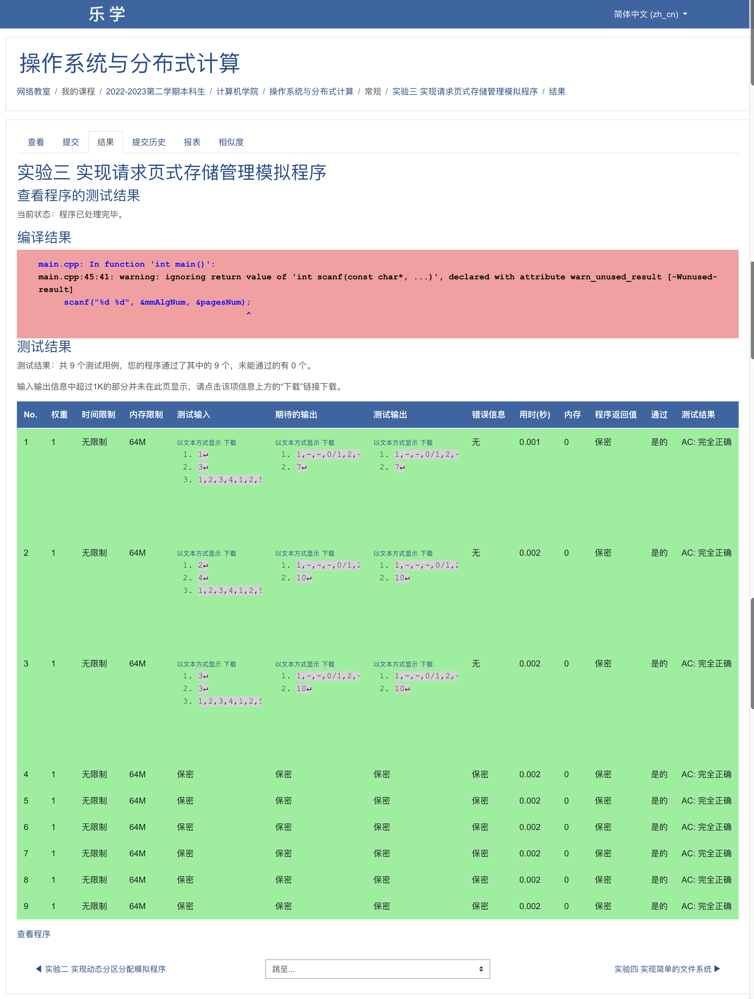

# 操作系统实验3——页面管理算法实验

### 1. 实验目的

本次实验需要我们理解页式存储管理的概念和原理，包括虚拟内存和物理内存之间的映射关系。其次需要我们学习页式存储管理中的地址转换机制和页面置换算法，并比较它们的性能和特点。第三，我们要掌握如何实现和设计页式存储管理模拟程序的基本步骤和技巧。随后可以通过分析来评估不同的页式存储管理策略在不同情况下的效果和性能。实验要求如下：

1. 从键盘输入页面访问序列及分配给进程的内存块数。
2. 分别采用OPT、FIFO和LRU算法进行页面置换（说明：对于OPT算法，在有多个页面可选的情况下，先淘汰较早进入的页面）。
3. 计算缺页次数及缺页率。

### 2. 数据结构和符号说明

- 枚举变量页面置换算法标签：包含OPT、FIFO、LRU算法。
- 枚举变量页面命中标签：表示页面是否被命中。
- 枚举变量驻留集空闲页标签：表示是否为空闲页。
- 驻留集结构体：包含进程号、优先级和距离。
- 函数指针pUpdate：用于代表更新函数的指针。
- 函数指针pReplace：用于代表页面置换函数的指针。
- 函数包含有页面添加函数、页面更新函数以及页面替换函数。

```c
#define MAX_SIZE 1024

enum memMgmtAlg {OPT = 1, FIFO, LRU};           // 页面置换算法标签
enum pageFlag {MISS = 0, HIT};                  // 页面命中标签
enum fullFlag {NOT_FULL = 0, FULL};             // 驻留集空闲页标签

struct residentSet {                            // 驻留集
    int pid;                                    // 进程号
    int priority;                               // 优先级
    int distance;                               // 距离
};
typedef void (*pUpdateFunc)(residentSet* rSet, int pageNum, int hitPage);
typedef void (*pReplaceFunc)(residentSet* rSet, int pageNum, const int* procSeq, int procNum, int currProc);
void pageAdd(residentSet* rSet, int pageNum, int freePage, const int* procSeq, int currProc);
void updateOPTandFIFO(residentSet* rSet, int pageNum, int hitPage);
void updateLRU(residentSet* rSet, int pageNum, int hitPage);
void replaceOPT(residentSet* rSet, int pageNum, const int* procSeq, int procNum, int currProc);
void replaceFIFO(residentSet* rSet, int pageNum, const int* procSeq, int procNum, int currProc);
void replaceLRU(residentSet* rSet, int pageNum, const int* procSeq, int procNum, int currProc);

```

### 3. 算法处理流程

#### 0. 主函数

主函数中首先初始化一系列变量，包括页面置换算法、驻留集、进程序列等。

- 读入输入内容

- 初始化驻留集和页面置换算法

- 读入进程序列

- 模拟算法执行

  1. 检查时候有空闲页面

  2. 检查页面时候命中

  3. 将页面加载到驻留集中
     已命中——>重置该进程参数并进入下一个进程(continue)
     未命中——>缺页中断
             驻留集未满：加载到驻留集中空闲页中
             驻留集已满：先采用页面置换策略得到空闲页，再加载该进程

  4. 输出
     4.1 输出当前驻留集中进程序列

     4.2 输出是否命中

     4.3 输出结束符

     4.4 输出缺页次数

```c
int main()
{
    // 页面置换算法
    int mmAlgNum;                               // 页面置换算法序号
    pUpdateFunc pageUpdate;                     // 更新驻留集页面
    pReplaceFunc pageReplace;                   // 替换驻留集页面
    // 驻留集
    int pagesNum;                               // 驻留集页面数
    // 进程序列
    int procSeq[MAX_SIZE] = {0};                // 进程序列
    int procNum = 0;                            // 进程序列总数
    // 缺页中断
    pageFlag hitFlag;                           // 命中标志
    int hitPage;                                // 命中页号
    fullFlag isFull;                            // 空闲标志
    int freePage;                               // 空闲页号
    int missTimes = 0;                          // 缺页次数
    // 1. 读入页面置换算法序号和驻留集页面数
    scanf("%d %d", &mmAlgNum, &pagesNum);
    // 2. 初始化驻留集和页面置换算法
    residentSet rSet[pagesNum];
    for (int i = 0; i < pagesNum; i++) {
        rSet[i].pid = -1;
        rSet[i].priority = -1;
        rSet[i].distance = MAX_SIZE;
    }
    switch (mmAlgNum) {
        case OPT: {
            pageUpdate = updateOPTandFIFO;
            pageReplace = replaceOPT;
            break;
        }
        case FIFO: {
            pageUpdate = updateOPTandFIFO;
            pageReplace = replaceFIFO;
            break;
        }
        case LRU: {
            pageUpdate = updateLRU;
            pageReplace = replaceLRU;
            break;
        }
        default: {
            printf("Unrecognized Algorithm.");
            exit(EXIT_FAILURE);
        }
    }
    // 3. 读入进程序列
    char tmpChar;
    while (scanf("%d", &procSeq[procNum])) {
        procNum++;
        tmpChar = getchar();
        if (tmpChar == ',') continue;
        else if (tmpChar == '\n') break;
    }
    // 4. 模拟执行
    for (int i = 0; i < procNum; i++) {
        // 1. 检查是否有空闲页面
        isFull = FULL;
        freePage = -1;
        for (int j = 0; j < pagesNum; j++) {
            if (rSet[j].pid == -1) {
                isFull = NOT_FULL;              // 说明驻留集中还有空闲页面
                freePage = j;                   // 记录驻留集中空闲页下标
                break;
            }
        }
        // 2. 检查是否命中
        hitFlag = MISS;
        hitPage = -1;
        for (int j = 0; j < pagesNum; j++) {
            if (rSet[j].pid == procSeq[i]) {
                hitFlag = HIT;                  // 说明驻留集中存在命中的页面
                hitPage = j;                    // 记录命中页驻留集下标
                break;
            }
        }
        // 3. 将页面加载到驻留集中
        //    已命中——>重置该进程参数并进入下一个进程(continue)
        //    未命中——>缺页中断
        //            驻留集未满：加载到驻留集中空闲页中
        //            驻留集已满：先采用页面置换策略得到空闲页，再加载该进程
        if (hitFlag) {                          // 命中驻留集中的页面：更新参数
            pageUpdate(rSet, pagesNum, hitPage);
        } else {
            if (isFull) {                       // 驻留集已满：页面置换
                pageReplace(rSet, pagesNum, procSeq, procNum, i);
            } else {               // 驻留集未满：将进程页面添加到驻留集中
                pageAdd(rSet, pagesNum, freePage, procSeq, i);
            }
            missTimes++;
        }
        // 4. 输出
        // 4.1 输出当前驻留集中进程序列
        for (int k = 0; k < pagesNum; k++) {
            if (rSet[k].pid != -1) printf("%d,", rSet[k].pid);
            else printf("-,");
        }
        // 4.2 输出是否命中
        printf("%d", hitFlag);
        // 4.3 输出结束符
        if (i < procNum - 1) printf("/");
        else printf("\n");
    }
    // 4.4 输出缺页次数
    printf("%d\n", missTimes);
    return 0;
}
```

#### 1. 页面添加函数

若驻留集中还有空间，则直接添加页面到驻留集。

```c
void pageAdd(residentSet* rSet, int pageNum, int freePage, const int* procSeq, int currProc)
{
    // 驻留集中已有页优先级均下调一个单位
    for (int i = 0; i < pageNum; i++)
        if (rSet[i].pid != -1)
            rSet[i].priority += 1;
    rSet[freePage].pid = procSeq[currProc];
    rSet[freePage].priority = 0;
}
```

#### 2. 页面更新函数（OPT算法和FIFO算法）

OPT算法和FIFO算法对于命中进程的更新是相似的，依次调整驻留集中的进程的优先级。

```c
void updateOPTandFIFO(residentSet* rSet, int pageNum, int hitPage)
{
    // 驻留集中已有页优先级调整
    for (int i = 0; i < pageNum; i++)
        if (rSet[i].pid != -1)
            rSet[i].priority += 1;
}
```

#### 3. 页面更新函数（LRU算法）

LRU算法中对于命中进程，除了更新驻留集中优先级外，还需要对命中页特别处理。

```c
void updateLRU(residentSet* rSet, int pageNum, int hitPage)
{
    int freePages = 0;
    for (int i = 0; i < pageNum; i++) {
        if (rSet[i].pid == -1)
            freePages++;
    }
    residentSet tmp = rSet[hitPage];
    for (int i = hitPage; i < pageNum - freePages; i++) {
        rSet[i] = rSet[i+1];
    }
    rSet[pageNum-freePages-1] = tmp;
}
```

#### 4. 页面替换算法（OPT算法）

OPT算法中，首先需要对驻留集中已有的页面进行优先级调整，随后计算距离并选择距离最大的页面进行替换即可。

```c
void replaceOPT(residentSet* rSet, int pageNum, const int* procSeq, int procNum, int currProc)
{
    int tmpIndex = 0;                           // 临时下标
    int maxDistance = 0;                        // 最大距离
    // 驻留集中已有页优先级调整
    for (int i = 0; i < pageNum; i++) {
        if (rSet[i].pid != -1)
            rSet[i].priority += 1;
        rSet[i].distance = MAX_SIZE;
    }
    // 计算距离
    for (int i = 0; i < pageNum; i++) {
        for (int j = currProc; j < procNum; j++) {
            if (rSet[i].pid == procSeq[j]) {
                rSet[i].distance = j - currProc;
                break;
            }
        }
    }
    // 选择最大距离
    maxDistance = rSet[0].distance;
    for (int i = 0; i < pageNum; i++) {
        if (rSet[i].distance > maxDistance ||
            (rSet[i].distance == maxDistance && rSet[i].priority > rSet[tmpIndex].priority)) {
            maxDistance = rSet[i].distance;
            tmpIndex = i;
        }
    }
    rSet[tmpIndex].pid = procSeq[currProc];
    rSet[tmpIndex].priority = 0;
}
```

#### 5. 页面替换算法（FIFO算法）

FIFO算法中，首先对已有驻留集进行优先级调整，随后选择优先级最低的页面，最后替换即可。

```c
void replaceFIFO(residentSet* rSet, int pageNum, const int* procSeq, int procNum, int currProc)
{
    int toReplace = 0;
    // 驻留集中已有页优先级调整
    for (int i = 0; i < pageNum; i++)
        if (rSet[i].pid != -1)
            rSet[i].priority += 1;
    // 寻找优先级最低的页面
    for (int i = 0; i < pageNum; i++)
        if (rSet[i].priority > rSet[toReplace].priority)
            toReplace = i;
    // 替换
    rSet[toReplace].pid = procSeq[currProc];
    rSet[toReplace].priority = 0;
}
```

#### 6. 页面置换算法（LRU算法）

LRU算法的替换策略，仅需推出驻留集中最头部的页面，随后添加新页面到驻留集结尾即可。

```c
void replaceLRU(residentSet* rSet, int pageNum, const int* procSeq, int procNum, int currProc)
{
    for (int i = 0; i < pageNum; i++) {
        rSet[i] = rSet[i+1];
    }
    rSet[pageNum - 1].pid = procSeq[currProc];
}
```


### 4. 源程序及注释

完整源代码及注释如下：

```c
/* Paged Memory Management */
#include <cstdio>
#include <cstdlib>

#define MAX_SIZE 1024

using namespace std;

enum memMgmtAlg {OPT = 1, FIFO, LRU};           // 页面置换算法标签
enum pageFlag {MISS = 0, HIT};                  // 页面命中标签
enum fullFlag {NOT_FULL = 0, FULL};             // 驻留集空闲页标签

struct residentSet {                            // 驻留集
    int pid;                                    // 进程号
    int priority;                               // 优先级
    int distance;                               // 距离
};
typedef void (*pUpdateFunc)(residentSet* rSet, int pageNum, int hitPage);
typedef void (*pReplaceFunc)(residentSet* rSet, int pageNum, const int* procSeq, int procNum, int currProc);
void pageAdd(residentSet* rSet, int pageNum, int freePage, const int* procSeq, int currProc);
void updateOPTandFIFO(residentSet* rSet, int pageNum, int hitPage);
void updateLRU(residentSet* rSet, int pageNum, int hitPage);
void replaceOPT(residentSet* rSet, int pageNum, const int* procSeq, int procNum, int currProc);
void replaceFIFO(residentSet* rSet, int pageNum, const int* procSeq, int procNum, int currProc);
void replaceLRU(residentSet* rSet, int pageNum, const int* procSeq, int procNum, int currProc);

int main()
{
    // 页面置换算法
    int mmAlgNum;                               // 页面置换算法序号
    pUpdateFunc pageUpdate;                     // 更新驻留集页面
    pReplaceFunc pageReplace;                   // 替换驻留集页面
    // 驻留集
    int pagesNum;                               // 驻留集页面数
    // 进程序列
    int procSeq[MAX_SIZE] = {0};                // 进程序列
    int procNum = 0;                            // 进程序列总数
    // 缺页中断
    pageFlag hitFlag;                           // 命中标志
    int hitPage;                                // 命中页号
    fullFlag isFull;                            // 空闲标志
    int freePage;                               // 空闲页号
    int missTimes = 0;                          // 缺页次数
    // 1. 读入页面置换算法序号和驻留集页面数
    scanf("%d %d", &mmAlgNum, &pagesNum);
    // 2. 初始化驻留集和页面置换算法
    residentSet rSet[pagesNum];
    for (int i = 0; i < pagesNum; i++) {
        rSet[i].pid = -1;
        rSet[i].priority = -1;
        rSet[i].distance = MAX_SIZE;
    }
    switch (mmAlgNum) {
        case OPT: {
            pageUpdate = updateOPTandFIFO;
            pageReplace = replaceOPT;
            break;
        }
        case FIFO: {
            pageUpdate = updateOPTandFIFO;
            pageReplace = replaceFIFO;
            break;
        }
        case LRU: {
            pageUpdate = updateLRU;
            pageReplace = replaceLRU;
            break;
        }
        default: {
            printf("Unrecognized Algorithm.");
            exit(EXIT_FAILURE);
        }
    }
    // 3. 读入进程序列
    char tmpChar;
    while (scanf("%d", &procSeq[procNum])) {
        procNum++;
        tmpChar = getchar();
        if (tmpChar == ',') continue;
        else if (tmpChar == '\n') break;
    }
    // 4. 模拟执行
    for (int i = 0; i < procNum; i++) {
        // 1. 检查是否有空闲页面
        isFull = FULL;
        freePage = -1;
        for (int j = 0; j < pagesNum; j++) {
            if (rSet[j].pid == -1) {
                isFull = NOT_FULL;              // 说明驻留集中还有空闲页面
                freePage = j;                   // 记录驻留集中空闲页下标
                break;
            }
        }
        // 2. 检查是否命中
        hitFlag = MISS;
        hitPage = -1;
        for (int j = 0; j < pagesNum; j++) {
            if (rSet[j].pid == procSeq[i]) {
                hitFlag = HIT;                  // 说明驻留集中存在命中的页面
                hitPage = j;                    // 记录命中页驻留集下标
                break;
            }
        }
        // 3. 将页面加载到驻留集中
        //    已命中——>重置该进程参数并进入下一个进程(continue)
        //    未命中——>缺页中断
        //            驻留集未满：加载到驻留集中空闲页中
        //            驻留集已满：先采用页面置换策略得到空闲页，再加载该进程
        if (hitFlag) {                          // 命中驻留集中的页面：更新参数
            pageUpdate(rSet, pagesNum, hitPage);
        } else {
            if (isFull) {                       // 驻留集已满：页面置换
                pageReplace(rSet, pagesNum, procSeq, procNum, i);
            } else {               // 驻留集未满：将进程页面添加到驻留集中
                pageAdd(rSet, pagesNum, freePage, procSeq, i);
            }
            missTimes++;
        }
        // 4. 输出
        // 4.1 输出当前驻留集中进程序列
        for (int k = 0; k < pagesNum; k++) {
            if (rSet[k].pid != -1) printf("%d,", rSet[k].pid);
            else printf("-,");
        }
        // 4.2 输出是否命中
        printf("%d", hitFlag);
        // 4.3 输出结束符
        if (i < procNum - 1) printf("/");
        else printf("\n");
    }
    // 4.4 输出缺页次数
    printf("%d\n", missTimes);
    return 0;
}

void pageAdd(residentSet* rSet, int pageNum, int freePage, const int* procSeq, int currProc)
{
    // 驻留集中已有页优先级均下调一个单位
    for (int i = 0; i < pageNum; i++)
        if (rSet[i].pid != -1)
            rSet[i].priority += 1;
    rSet[freePage].pid = procSeq[currProc];
    rSet[freePage].priority = 0;
}
void updateOPTandFIFO(residentSet* rSet, int pageNum, int hitPage)
{
    // 驻留集中已有页优先级调整
    for (int i = 0; i < pageNum; i++)
        if (rSet[i].pid != -1)
            rSet[i].priority += 1;
}
void updateLRU(residentSet* rSet, int pageNum, int hitPage)
{
    int freePages = 0;
    for (int i = 0; i < pageNum; i++) {
        if (rSet[i].pid == -1)
            freePages++;
    }
    residentSet tmp = rSet[hitPage];
    for (int i = hitPage; i < pageNum - freePages; i++) {
        rSet[i] = rSet[i+1];
    }
    rSet[pageNum-freePages-1] = tmp;
}
void replaceOPT(residentSet* rSet, int pageNum, const int* procSeq, int procNum, int currProc)
{
    int tmpIndex = 0;                           // 临时下标
    int maxDistance = 0;                        // 最大距离
    // 驻留集中已有页优先级调整
    for (int i = 0; i < pageNum; i++) {
        if (rSet[i].pid != -1)
            rSet[i].priority += 1;
        rSet[i].distance = MAX_SIZE;
    }
    // 计算距离
    for (int i = 0; i < pageNum; i++) {
        for (int j = currProc; j < procNum; j++) {
            if (rSet[i].pid == procSeq[j]) {
                rSet[i].distance = j - currProc;
                break;
            }
        }
    }
    // 选择最大距离
    maxDistance = rSet[0].distance;
    for (int i = 0; i < pageNum; i++) {
        if (rSet[i].distance > maxDistance ||
            (rSet[i].distance == maxDistance && rSet[i].priority > rSet[tmpIndex].priority)) {
            maxDistance = rSet[i].distance;
            tmpIndex = i;
        }
    }
    rSet[tmpIndex].pid = procSeq[currProc];
    rSet[tmpIndex].priority = 0;
}
void replaceFIFO(residentSet* rSet, int pageNum, const int* procSeq, int procNum, int currProc)
{
    int toReplace = 0;
    // 驻留集中已有页优先级调整
    for (int i = 0; i < pageNum; i++)
        if (rSet[i].pid != -1)
            rSet[i].priority += 1;
    // 寻找优先级最低的页面
    for (int i = 0; i < pageNum; i++)
        if (rSet[i].priority > rSet[toReplace].priority)
            toReplace = i;
    // 替换
    rSet[toReplace].pid = procSeq[currProc];
    rSet[toReplace].priority = 0;
}
void replaceLRU(residentSet* rSet, int pageNum, const int* procSeq, int procNum, int currProc)
{
    for (int i = 0; i < pageNum; i++) {
        rSet[i] = rSet[i+1];
    }
    rSet[pageNum - 1].pid = procSeq[currProc];
}
```

### 5. 测试方法与结果

本次实验的测试使用黑盒测试的方法，借助乐学在线OJ系统，最终结果为测试全部通过。



### 6. 实验经验和体会

在进行页式存储管理模拟实验之前，要仔细设计实验方案。考虑不同的页表大小以及不同的页面置换算法。确保实验设计合理，能够充分评估不同策略的性能和特点。在编写模拟程序时，要确保页面置换算法的实现正确无误。特别要注意边界条件和特殊情况的处理，以保证模拟程序的正确性和可靠性。在进行实验时，要准确记录实验数据，包括页表的访问情况、缺页次数、页面置换次数等指标。通过这次实验，我深入了解了页式存储管理的算法，并通过实践加深了对其原理的理解。实验过程中的经验和体会让我更加熟悉操作系统内存管理的重要性和复杂性，也为今后深入研究和应用相关领域的技术打下了基础。