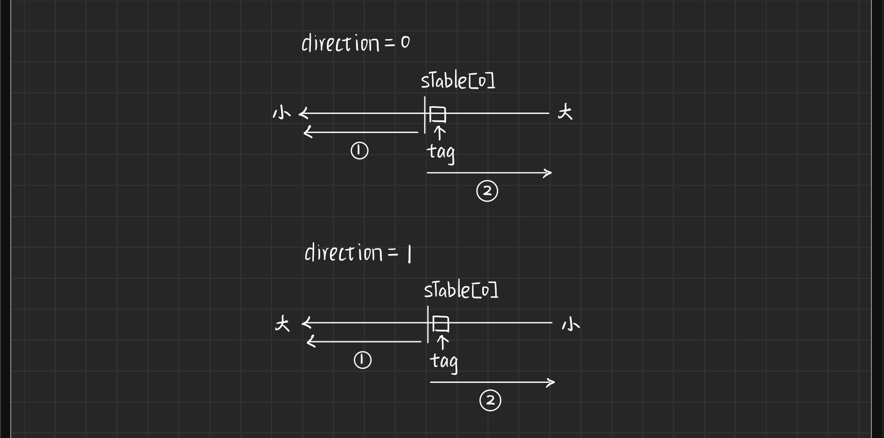
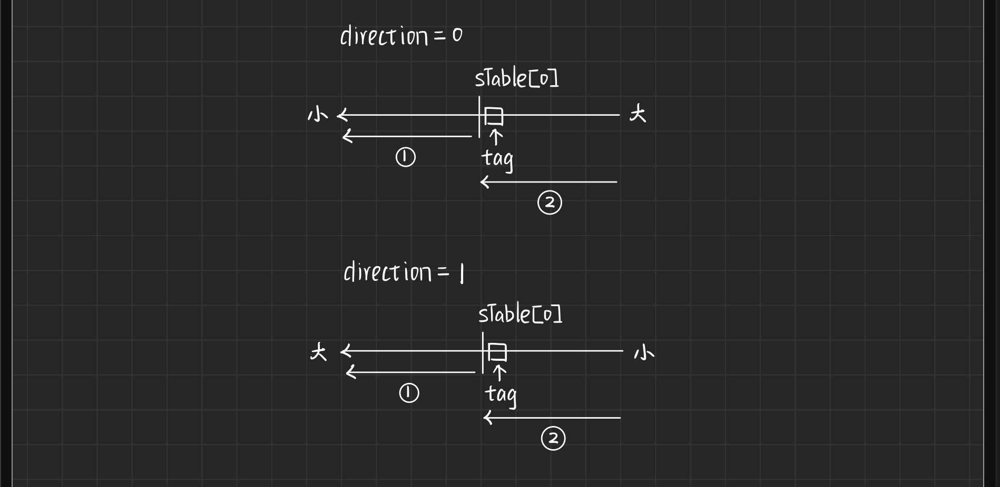
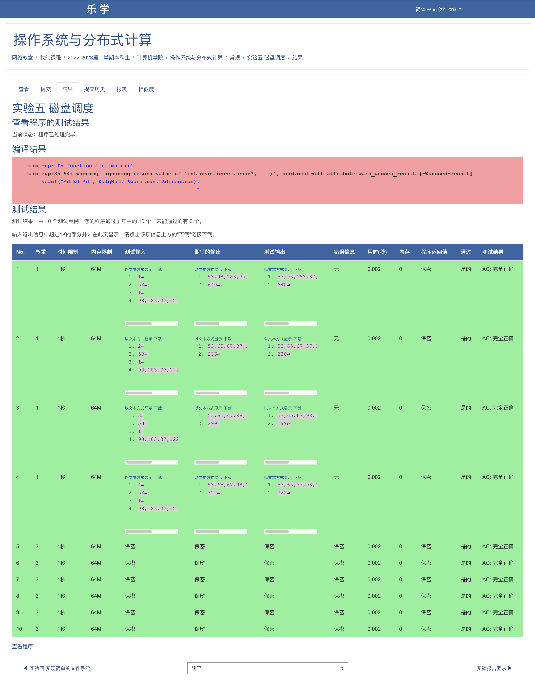

### 1. 实验目的

本实验的目的是通过模拟磁盘的寻道过程，评估和比较不同的磁盘寻道调度算法的性能。该实验旨在加深对磁盘寻道调度算法的理解，并通过实际模拟来观察和分析不同算法在磁盘访问效率方面的差异。

实验要求编写一个磁盘调度程序，模拟操作系统对磁盘的调度。该程序可以随机输入磁道请求序列，当前磁头位置和磁头移动方向，支持先来先服务、最短寻道时间优先、扫描、循环扫描调度算法，能够输出磁头移动经过的磁道序列。

### 2. 数据结构和符号说明

- 枚举变量算法调度算法标签：包含FCFS、SSTF、SCAN、CSCAN算法。

- 枚举变量磁道访问任务状态：用来表示磁道访问任务是否完成。

- 寻道任务结构体

  每一个寻道请求需要构建一个寻道任务，包含目标磁道、当前磁道到目标磁道的距离、任务状态三个成员变量。

  ```c++
  struct dSeekTask {                                          // 寻道任务结构体
      int track;                                              // 目标磁道
      int distance;                                           // 当前磁道到目标磁道的距离
      taskState state;                                        // 任务状态
  } tasks[MAX_SIZE];                                          // 任务队列
  ```

- 全局变量

  - `tasks`：用于表示任务请求队列。
  - `sTable`：用于记录磁头移动经过的磁道序列。
  - `taskNum`：用于记录总任务数。
  - `totalTracks`：用于记录磁头移动经过的总磁道数。

  ```c++
  int sTable[MAX_SIZE];                                       // 任务计划表
  int taskNum;                                                // 任务总数
  int totalTracks;                                            // 总寻道数
  ```

- 函数说明

  ```c++
  void FCFS();                                                // 先来先服务
  void SSTF();                                                // 最短寻道时间优先
  void SCAN(int mvDirection);                                 // 扫描法
  void CSCAN(int mvDirection);                                // 循环扫描法
  int getDistance(int x, int y);                              // 距离计算函数
  void output();                                              // 输出结果函数
  ```

### 3. 算法处理流程

#### 0. 主函数

1. 读取磁盘调度算法、当前磁头位置、磁头移动方向、磁道请求序列并初始化总任务数`taskNum`和磁头移动经过的总磁道数`totalTracks`。
2. 根据读入参数，选择相应的磁盘调度算法并执行。
3. 输出磁头移动经过的磁道序列和磁头移动经过的总磁道数。

#### 1. FCFS函数

FCFS中仅仅需要将请求序列依照输入次序填写到磁头移动经过的磁道序列中即可，在此过程中同时统计磁头移动经过的总磁道数。

```c++
void FCFS() {
    for (int i = 0; i < taskNum; i++) {
        sTable[i+1] = tasks[i].track;
        tasks[i].state = FINISHED;
        totalTracks += getDistance(sTable[i], tasks[i].track);
    }
}
```

#### 2. SSTF函数

SSFT中每次需要选择距离当前位置距离最小的磁道，因此需要构建双层循环即可。外层循环用来完成sTable的构建，内层循环用于选择距离最近的磁道。

```c++
void SSTF() {
    // 外层循环用来完成sTable的构建，内层循环用于选择距离最近的磁道
    for (int i = 1; i <= taskNum; i++) {
        // 寻找当前距离最小的磁道
        int minDis = MAX_SIZE;
        int tmpDis = MAX_SIZE;
        int tag = 0;
        for (int j = 0; j < taskNum; j++) {
            if (tasks[j].state == UNFINISHED) {
                tmpDis = getDistance(sTable[i-1], tasks[j].track);
                if (tmpDis < minDis) {
                    minDis = tmpDis;
                    tag = j;
                }
            }
        }
        sTable[i] = tasks[tag].track;
        tasks[tag].state = FINISHED;
        totalTracks += minDis;
    }
}
```

#### 3. SCAN函数

SCAN中，首先对请求队列进行排序，随后记录分隔符所在的位置，所谓分隔符号即为磁头开始的位置，将请求队列分为两部分，一部分为磁道号小于分隔符的任务，另一部分为磁道号大于分隔符的任务。示意图如下：



```c++
// 扫描法
void SCAN(int mvDirection) {
    // 1. 排序
    if (mvDirection == 0) {
        sort(tasks, tasks + taskNum, [] (dSeekTask a, dSeekTask b) { return a.track < b.track; });
    } else if (mvDirection == 1) {
        sort(tasks, tasks + taskNum, [] (dSeekTask a, dSeekTask b) { return a.track > b.track; });
    }
    // 2. 获取分隔下标
    int tag = 0;
    for (int i = 0; i < taskNum; i++) {
        if (mvDirection==0 && tasks[i].track > sTable[0]) {
            tag = i;
            break;
        } else if (mvDirection==1 && tasks[i].track < sTable[0]) {
            tag = i;
            break;
        }
    }
    // 3. 填表
    int sTag = 0;
    for (int i = tag - 1; i >= 0; i--) {
        sTable[sTag+1] = tasks[i].track;
        tasks[i].state = FINISHED;
        totalTracks += getDistance(sTable[sTag], tasks[i].track);
        sTag++;
    }
    for (int i = tag; i < taskNum; i++) {
        sTable[sTag+1] = tasks[i].track;
        tasks[i].state = FINISHED;
        totalTracks += getDistance(sTable[sTag], tasks[i].track);
        sTag++;
    }
}
```

#### 4. CSCAN函数

CSCAN函数中只是在SCAN的基础上始终朝一个方向扫描，因此将第二部分填入sTable的方向进行修改即可。示意图如下：



```c++
// 循环扫描法
void CSCAN(int mvDirection) {
    // 1. 排序
    if (mvDirection == 0) {
        sort(tasks, tasks + taskNum, [] (dSeekTask a, dSeekTask b) { return a.track < b.track; });
    } else if (mvDirection == 1) {
        sort(tasks, tasks + taskNum, [] (dSeekTask a, dSeekTask b) { return a.track > b.track; });
    }
    // 2. 获取分隔下标
    int tag = 0;
    for (int i = 0; i < taskNum; i++) {
        if (mvDirection==0 && tasks[i].track > sTable[0]) {
            tag = i;
            break;
        } else if (mvDirection==1 && tasks[i].track < sTable[0]) {
            tag = i;
            break;
        }
    }
    // 3. 填表
    int sTag = 0;
    // 填写分隔符左边的任务
    for (int i = tag - 1; i >= 0; i--) {
        sTable[sTag+1] = tasks[i].track;
        tasks[i].state = FINISHED;
        totalTracks += getDistance(sTable[sTag], tasks[i].track);
        sTag++;
    }
    // 填写分隔符右边的任务
    for (int i = taskNum - 1; i >= tag; i--) {
        sTable[sTag+1] = tasks[i].track;
        tasks[i].state = FINISHED;
        totalTracks += getDistance(sTable[sTag], tasks[i].track);
        sTag++;
    }
}
```

### 4. 源程序及注释

完整源代码及注释如下：

```c
#include<cstdio>
#include<cstdlib>
#include<algorithm>

#define MAX_SIZE 65535

using namespace std;

enum diskScheduleAlg {_FCFS = 1, _SSTF, _SCAN, _CSCAN};     // 磁盘调度算法标签
enum taskState {UNFINISHED, FINISHED};                      // 磁道访问任务状态

struct dSeekTask {                                          // 寻道任务结构体
    int track;                                              // 目标磁道
    int distance;                                           // 当前磁道到目标磁道的距离
    taskState state;                                        // 任务状态
} tasks[MAX_SIZE];                                          // 任务队列
int sTable[MAX_SIZE];                                       // 任务计划表
int taskNum;                                                // 任务总数
int totalTracks;                                            // 总寻道数

void FCFS();                                                // 先来先服务
void SSTF();                                                // 最短寻道时间优先
void SCAN(int mvDirection);                                 // 扫描法
void CSCAN(int mvDirection);                                // 循环扫描法
int getDistance(int x, int y);                              // 距离计算函数
void output();                                              // 输出结果函数

int main() {
    // 1. 读取算法、当前轨道号以及磁臂移动方向并进行初始化
    int algNum;
    int position;
    int direction;
    taskNum = 0;
    totalTracks = 0;
    scanf("%d %d %d", &algNum, &position, &direction);
    sTable[0] = position;
    // 2. 读取磁道请求序列
    char tmpChar;
    while (scanf("%d", &tasks[taskNum].track)) {
        tasks[taskNum].distance = MAX_SIZE;
        tasks[taskNum].state = UNFINISHED;
        taskNum++;
        tmpChar = getchar();
        if (tmpChar == ',') continue;
        else if (tmpChar == '\n') break;
    }
    // 3. 执行算法
    switch (algNum) {
        case _FCFS: FCFS(); break;
        case _SSTF: SSTF(); break;
        case _SCAN: SCAN(direction); break;
        case _CSCAN: CSCAN(direction); break;
    }
    // 4. 输出结果
    output();
    return 0;
}
// 距离计算函数
int getDistance(int x, int y) {
    return abs(x-y);
}
// 先来先服务
void FCFS() {
    for (int i = 0; i < taskNum; i++) {
        sTable[i+1] = tasks[i].track;
        tasks[i].state = FINISHED;
        totalTracks += getDistance(sTable[i], tasks[i].track);
    }
}
// 最短寻道时间优先
void SSTF() {
    // 外层循环用来完成sTable的构建，内层循环用于选择距离最近的磁道
    for (int i = 1; i <= taskNum; i++) {
        // 寻找当前距离最小的磁道
        int minDis = MAX_SIZE;
        int tmpDis = MAX_SIZE;
        int tag = 0;
        for (int j = 0; j < taskNum; j++) {
            if (tasks[j].state == UNFINISHED) {
                tmpDis = getDistance(sTable[i-1], tasks[j].track);
                if (tmpDis < minDis) {
                    minDis = tmpDis;
                    tag = j;
                }
            }
        }
        sTable[i] = tasks[tag].track;
        tasks[tag].state = FINISHED;
        totalTracks += minDis;
    }
}
// 扫描法
void SCAN(int mvDirection) {
    // 1. 排序
    if (mvDirection == 0) {
        sort(tasks, tasks + taskNum, [] (dSeekTask a, dSeekTask b) { return a.track < b.track; });
    } else if (mvDirection == 1) {
        sort(tasks, tasks + taskNum, [] (dSeekTask a, dSeekTask b) { return a.track > b.track; });
    }
    // 2. 获取分隔下标
    int tag = 0;
    for (int i = 0; i < taskNum; i++) {
        if (mvDirection==0 && tasks[i].track > sTable[0]) {
            tag = i;
            break;
        } else if (mvDirection==1 && tasks[i].track < sTable[0]) {
            tag = i;
            break;
        }
    }
    // 3. 填表
    int sTag = 0;
    for (int i = tag - 1; i >= 0; i--) {
        sTable[sTag+1] = tasks[i].track;
        tasks[i].state = FINISHED;
        totalTracks += getDistance(sTable[sTag], tasks[i].track);
        sTag++;
    }
    for (int i = tag; i < taskNum; i++) {
        sTable[sTag+1] = tasks[i].track;
        tasks[i].state = FINISHED;
        totalTracks += getDistance(sTable[sTag], tasks[i].track);
        sTag++;
    }
}
// 循环扫描法
void CSCAN(int mvDirection) {
    // 1. 排序
    if (mvDirection == 0) {
        sort(tasks, tasks + taskNum, [] (dSeekTask a, dSeekTask b) { return a.track < b.track; });
    } else if (mvDirection == 1) {
        sort(tasks, tasks + taskNum, [] (dSeekTask a, dSeekTask b) { return a.track > b.track; });
    }
    // 2. 获取分隔下标
    int tag = 0;
    for (int i = 0; i < taskNum; i++) {
        if (mvDirection==0 && tasks[i].track > sTable[0]) {
            tag = i;
            break;
        } else if (mvDirection==1 && tasks[i].track < sTable[0]) {
            tag = i;
            break;
        }
    }
    // 3. 填表
    int sTag = 0;
    // 填写分隔符左边的任务
    for (int i = tag - 1; i >= 0; i--) {
        sTable[sTag+1] = tasks[i].track;
        tasks[i].state = FINISHED;
        totalTracks += getDistance(sTable[sTag], tasks[i].track);
        sTag++;
    }
    // 填写分隔符右边的任务
    for (int i = taskNum - 1; i >= tag; i--) {
        sTable[sTag+1] = tasks[i].track;
        tasks[i].state = FINISHED;
        totalTracks += getDistance(sTable[sTag], tasks[i].track);
        sTag++;
    }
}
// 输出函数
void output() {
    for (int i = 0; i < taskNum; i++) {
        printf("%d,", sTable[i]);
    }
    printf("%d\n", sTable[taskNum]);
    printf("%d\n", totalTracks);
}
```

### 5. 测试方法与结果

本次实验的测试使用黑盒测试的方法，借助乐学在线OJ系统，最终结果为测试全部通过。



### 6. 实验经验和体会

在进行磁盘寻道调度算法模拟实验时，我深入理解了磁盘IO操作的原理和磁盘寻道过程。通过实际模拟磁盘的寻道操作，并实现了几种常见的磁盘寻道调度算法，我对不同算法在提高磁盘访问效率方面的效果有了更深入的了解。

在模拟实验过程中，我注意到不同的磁盘寻道调度算法在不同的磁盘访问序列下表现出不同的性能。先来先服务算法（FCFS）简单直观，但可能导致长时间的等待和延迟。最短寻道时间优先算法（SSTF）能够减少寻道时间，但可能会导致某些请求长时间等待。电梯扫描算法（SCAN）通过改变磁头的移动方向，使得寻道时间相对均匀分布，但可能会导致某些请求长时间等待。循环电梯扫描算法（CSCAN）在电梯扫描算法采用单方向移动磁头，CSCAN算法相较于SCAN算法可以更好地最小化平均等待时间，并且可以一定程度上避免SCAN算法中的饥饿问题。

通过对比不同算法的性能指标——总体访问时间，可以评估算法的优劣和适用场景。我发现在磁盘访问序列较为随机的情况下，SSTF算法通常表现较好，能够有效减少寻道时间。而在磁盘访问序列有较强方向性的情况下，SCAN和CSCAN算法能够更好地利用磁头移动的特点，提高访问效率。

通过本次实验，我不仅加深了对磁盘寻道调度算法的理解，还学会了如何实现不同调度算法的实现。此外，我也意识到了磁盘调度算法对系统性能的影响，并且知道了要根据实际情况选择合适的算法并进行优化。